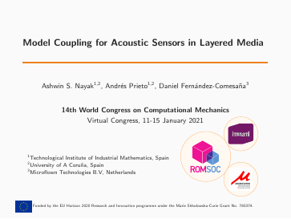
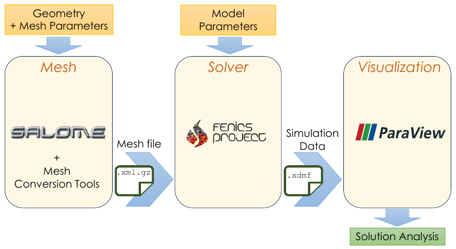

# Coupled models for acoustic propagation through multilayer systems for particle-velocity sensors
[](https://doi.org/10.5281/zenodo.5171815)

The repository contains scripts for generating the relevant meshes and computing the 
scattering of a plane wave by the Microflown PU Regular Probe. The probe may include 
layers of steel mesh and porous windscreens.

The motivation and technical details of the source code are highlighted in the talk 
"_Model Coupling for Acoustic Sensors in Layered Media_"
presented at a minisymposium at the World Congress in Computational Mechanics (Jan 2021).

<p align="center">
  <a href="resources/202101_WCCM2020.pdf">  </a> <br \>
  <i> <small> (Click image to view presentation) </small> </i>
</p>

<hr style="border:1px"> </hr>

### DESCRIPTION

<p align="center">
   <br \>
  <i> Software tools workflow </i>
</p>

- To generate a mesh, you'd need [SALOME](https://www.salome-platform.org/). 
  The scripts were verified to run with SALOME v8.4.0, v9.2.1 and v9.4.0.
- Run e.g., `source/00_meshes/sphere.py` in command line (without firing up the GUI) as,

```bash
/path/to/executable/salome --terminal sphere.py
```

- Convert the `.unv` mesh files from SALOME to `.xml.gz` with [`FEConv`](http://victorsndvg.github.io/FEconv/) and `dolfin-convert`(available with FEniCS) utilites. (Alternatively, [`meshio-convert`](https://github.com/nschloe/meshio) may also serve, although it may have some compatibility issues with FEniCS) 

```bash
# FEconv 
feconv -gm sphere.unv sphere.msh          # converts to Gmsh format
dolfin-convert sphere.msh sphere.xml      # Gmsh to FEniCS xml

# OR with meshio (some known issues)
meshio-convert sphere.unv sphere.xml 

# Compress XML
gzip sphere.xml
```

- Verify parameters of the problem configuration in the script files to run.
- To run the program, run the respective script (`.py`) in the FEniCS v2019.1.0 docker container.
- The result files can be visualized easily with ParaView >v5.6.


Some additional instructions are included as README in the specific folders.

<hr style="border:1px"> </hr>

### DISCLAIMER

In downloading this SOFTWARE you are deemed to have read and agreed to the following terms:

This SOFTWARE has been designed with an exclusive focus on civil applications. It is not to be used
for any illegal, deceptive, misleading or unethical purpose or in any military applications. This includes ANY APPLICATION WHERE THE USE OF THE SOFTWARE MAY RESULT IN DEATH, PERSONAL INJURY OR SEVERE PHYSICAL OR ENVIRONMENTAL DAMAGE. Any redistribution of the software must retain this disclaimer. BY INSTALLING, COPYING, OR OTHERWISE USING THE SOFTWARE, YOU AGREE TO THE TERMS ABOVE. IF YOU DO NOT AGREE TO THESE TERMS, DO NOT INSTALL OR USE THE SOFTWARE

<hr style="border:1px" > </hr>

### ACKNOWLEDGEMENTS


The ROMSOC project has received funding from the European Union’s Horizon 2020 research and innovation programme under the Marie Skłodowska-Curie Grant Agreement No. 765374. This repository reflects the views of the author(s) and does not necessarily reflect the views or policy of the European Commission. The REA cannot be held responsible for any use that may be made of the information this repository contains.

<hr style="border:1px"> </hr>
