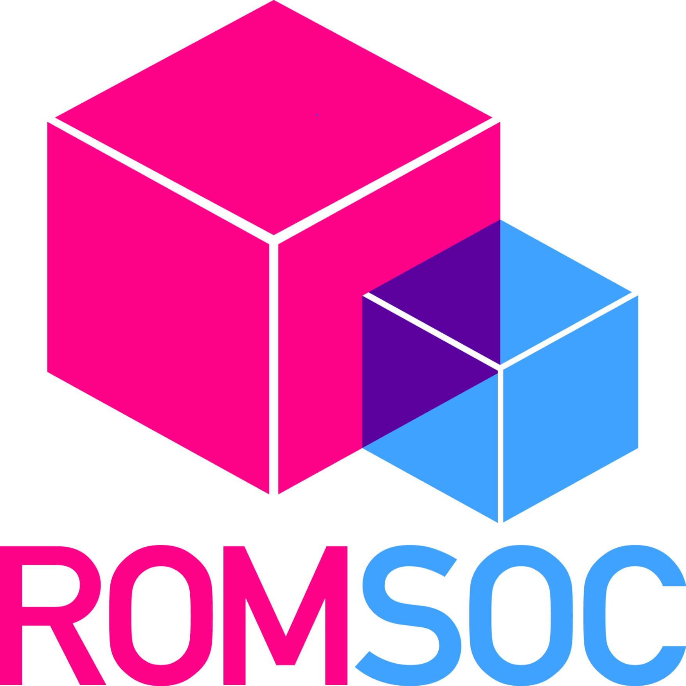

# Coupled models for acoustic propagation through multilayer systems for particle-velocity sensors
[](https://doi.org/10.5281/zenodo.5171815) [](https://mybinder.org/v2/gh/ROMSOC/benchmarks-acoustic-propagation/HEAD?labpath=source/02_scattering_sphere/radialwave_scattering_porous_coupling/scattering_sphere_porous.ipynb)

The repository contains scripts for generating the relevant meshes and computing the 
scattering of a plane wave by the Microflown PU Regular Probe. The probe may include 
layers of steel mesh and porous windscreens.

The motivation and technical details of the source code are highlighted in the talk 
"_Model Coupling for Acoustic Sensors in Layered Media_"
presented at a minisymposium at the World Congress in Computational Mechanics (Jan 2021).

<p align="center">
  <a href="resources/202101_WCCM2020.pdf">  </a>
  <i> <small> (Click image to view presentation) </small> </i>
</p>

<hr style="border:1px"> 

### DESCRIPTION

<p align="center">
   
  <i> Software tools workflow </i>
</p>

- To generate a mesh, you'd need [SALOME](https://www.salome-platform.org/). 
  The scripts were verified to run with SALOME v8.4.0, v9.2.1, v9.4.0, and v9.8.0.
- Run e.g., `source/00_meshes/sphere_porous_PML.py` in command line (without firing up the GUI) as,

```bash
/path/to/executable/salome -t python3 sphere.py
```

- Convert the `.unv` mesh files from SALOME to `.xml.gz` with [`FEConv`](http://victorsndvg.github.io/FEconv/) and `dolfin-convert`(available with FEniCS) utilites. (Alternatively, [`meshio-convert`](https://github.com/nschloe/meshio) may also serve, although it may have some compatibility issues with FEniCS) 

```bash
# FEconv 
feconv -gm sphere_porous_PML.unv sphere_porous_PML.msh          # converts to Gmsh format
dolfin-convert sphere_porous_PML.msh sphere_porous_PML.xml      # Gmsh to FEniCS xml

# OR with meshio (some known issues)
meshio-convert sphere_porous_PML.unv sphere_porous_PML.xml 

# Compress XML
gzip sphere_porous_PML.xml
```

- Verify parameters of the problem configuration in the script files to run.
- To run the program, run the respective script (`.py`) in the FEniCS v2019.2.0.dev0 docker container (see details below).
- The result files can be visualized easily with ParaView >v5.6.

Some additional instructions are included as README in the specific folders.

<hr style="border:1px">

### RUN JUPYTER NOTEBOOKS
The entire benchmark repository can be executed in a provided Docker container where a full installation of Salome, FEconv, FEniCS, and PyVista is available. Once you have clone or downloaded this repository, to build the container just type
```bash
docker build -t benchmarks-acoustic-propagation . 
```
and for running it locally:
```bash
docker run -u 0 -it --rm -p 8888:8888 benchmarks-thermomechanical-model jupyter-lab --ip=0.0.0.0 --port=8888 --allow-root
```

Alternatively, user-friendly Jupyter Notebooks could be used to run different benchmarks on the cloud. For instance, the benchmark related to the porous sphere scattering problem is available at:
[](https://mybinder.org/v2/gh/ROMSOC/benchmarks-acoustic-propagation/HEAD?labpath=source/02_scattering_sphere/radialwave_scattering_porous_coupling/scattering_sphere_porous.ipynb). Please, notice that mybinder cloud computations are limited to 2GB of RAM memory and the current setting of this benchamark with the mesh included in this repository requires around 8GB (it is recommended use this notebook for pre- and post-processing purposes).

<hr style="border:1px"> 

### DISCLAIMER

In downloading this SOFTWARE you are deemed to have read and agreed to the following terms:

This SOFTWARE has been designed with an exclusive focus on civil applications. It is not to be used
for any illegal, deceptive, misleading or unethical purpose or in any military applications. This includes ANY APPLICATION WHERE THE USE OF THE SOFTWARE MAY RESULT IN DEATH, PERSONAL INJURY OR SEVERE PHYSICAL OR ENVIRONMENTAL DAMAGE. Any redistribution of the software must retain this disclaimer. BY INSTALLING, COPYING, OR OTHERWISE USING THE SOFTWARE, YOU AGREE TO THE TERMS ABOVE. IF YOU DO NOT AGREE TO THESE TERMS, DO NOT INSTALL OR USE THE SOFTWARE

<hr style="border:1px" > 

### ACKNOWLEDGEMENTS


The ROMSOC project has received funding from the European Union’s Horizon 2020 research and innovation programme under the Marie Skłodowska-Curie Grant Agreement No. 765374. This repository reflects the views of the author(s) and does not necessarily reflect the views or policy of the European Commission. The REA cannot be held responsible for any use that may be made of the information this repository contains.

<hr style="border:1px"> 
